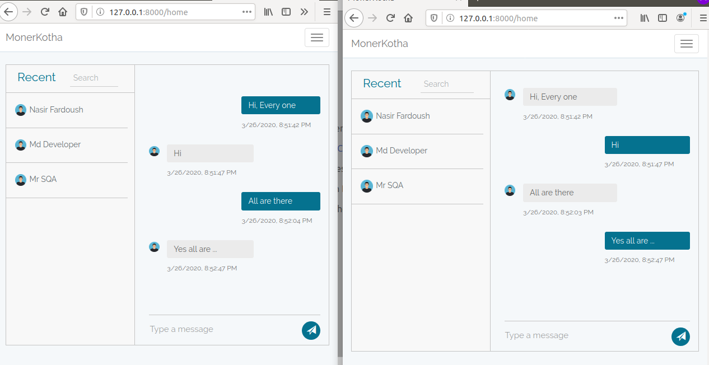

# MonerKotha

One to one, one to many, many to many real time chat applications



### Features done

- User login 
- User registration
- One to Many realtime chat
- Many to Many realtime chat

### Technology Used
 
###### Laravel | Vue js | Pusher
### Browser Support

 |  | 

Latest ✔ | Latest ✔ | Latest ✔ |


### Installing

Clone the project:

```bash
$ git clone https://github.com/md-nasir/monerkotha.git
```

Update composer:

```bash
$ update composer
```

####### Find this values and replace with your puhser account data :

```bash
XXX_PUSHER_APP_ID
XXX_PUSHER_APP_KEY
XXXP_USHER_APP_SECRET
```

Replace .env.monerkotha to .env and configure database and run 

```bash
$ php artisan migrate
```

## Now Enjoy Chating !!!
